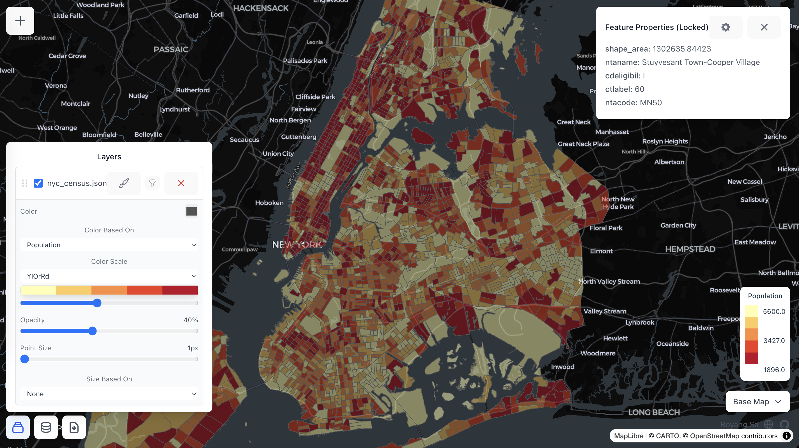

# MapViewer-GL

**Browser-based geospatial data viewer with SQL-powered analytics.**

Upload your data, style it on an interactive map, and run spatial queries — all locally in the browser with zero server-side processing.

[](https://bobsa514.github.io/mapviewer-gl/)
[](LICENSE)
[](https://deck.gl/)



## Why MapViewer-GL?

| | |
|---|---|
| **100% Client-Side** | Your data never leaves your browser. No server, no uploads, no tracking. |
| **SQL-Powered** | Every layer becomes a DuckDB table. Run spatial joins, aggregations, and filters with real SQL. |
| **Multi-Format** | GeoJSON, CSV, Shapefile, Parquet/GeoParquet — drag, drop, and go. |
| **Zero Config** | No API keys, no accounts, no setup. Just open and use. |

## Features at a Glance

### Multi-Format Data Loading

Drop files in any major geospatial format. CSVs without coordinates? They become SQL-only tables for JOINs.


**Supported formats:**
- **GeoJSON** — polygons, lines, points, multi-geometries
- **CSV** — auto-detects lat/lng columns or H3 hex indexes
- **Shapefile** — zipped `.shp`/`.dbf`/`.prj` bundles
- **Parquet / GeoParquet** — geometry auto-detected from WKB/BLOB columns
- **Map Configurations** — export/import full map state as JSON

### In-Browser SQL with DuckDB-WASM

Every data layer becomes a queryable SQL table powered by [DuckDB-WASM](https://duckdb.org/docs/api/wasm/overview). Run spatial joins across layers, filter with SQL, and add query results back to the map.


```sql
-- Spatial join: find trees within census tracts
SELECT t.*, c.population
FROM sf_trees t
JOIN census_tracts c ON ST_Within(t.geom, c.geom)
WHERE t.dbh > 30

-- Export results as CSV or add directly as a new map layer
```

DuckDB is lazy-loaded (~200 KB) only when you open the SQL editor — zero impact on initial page load.

### Map Styling & Layer Management

- Multiple free basemaps (Carto Light, Carto Dark, OpenStreetMap) — no API key needed
- Per-layer color and size symbology with classified breaks
- 8 sequential color scales (Reds, Blues, YlOrRd, etc.)
- Opacity, point size, and visibility controls
- Drag-and-drop layer reordering
- Interactive feature inspection on click
- Column-level data filtering with numeric and text modes
- Color and size legends

## Data Privacy

All processing happens locally in your browser. No data is uploaded to any server. When you close the tab, all data is gone.

## Quick Start

```bash
git clone https://github.com/bobsa514/mapviewer-gl.git
cd mapviewer-gl
corepack enable        # Enables Yarn 4
yarn install
yarn dev               # http://localhost:5173
```

Or just use the [live demo](https://bobsa514.github.io/mapviewer-gl/) — no install needed.

## Tech Stack

| Library | Purpose |
|---|---|
| [deck.gl](https://deck.gl/) | WebGL-accelerated map layers (GeoJSON, Scatterplot, H3) |
| [MapLibre GL JS](https://maplibre.org/) | Basemap rendering (via react-map-gl) |
| [DuckDB-WASM](https://duckdb.org/docs/api/wasm/overview) | In-browser SQL engine with spatial extension |
| [React](https://react.dev/) + [TypeScript](https://www.typescriptlang.org/) | UI framework |
| [Vite](https://vite.dev/) | Build tooling |
| [Tailwind CSS](https://tailwindcss.com/) | Styling |

<details>
<summary><strong>Project Structure</strong></summary>

```
src/
  types.ts                  # Shared type definitions
  utils/
    geometry.ts             # Coordinate extraction, bounds, color/size mapping
    csv.ts                  # CSV column detection and row processing
    layers.ts               # Numeric column detection for symbology
    shapefile.ts            # Shapefile ZIP parsing (code-split)
    duckdb.ts               # DuckDB-WASM init, table registration, query execution (code-split)
  components/
    MapViewerGL.tsx          # Main orchestrator — state management, deck.gl rendering
    Toast.tsx                # Toast notification system
    AddDataModal.tsx         # Tabbed file upload modal
    SQLEditor.tsx            # Split-pane SQL editor with results table
    LayersPanel.tsx          # Layer list with symbology controls and drag reorder
    FilterModal.tsx          # Column-level data filtering
    CSVPreviewModal.tsx      # CSV column selection before import
    GeoJSONPreviewModal.tsx  # GeoJSON property selection before import
    FeaturePropertiesPanel.tsx # On-click feature attribute inspector
    BasemapSelector.tsx      # Basemap style picker
    LegendDisplay.tsx        # Color and size legends
```

</details>

## Deployment

Automatically deployed to GitHub Pages on push to `main` via GitHub Actions.

## Contributing

See [CONTRIBUTING.md](CONTRIBUTING.md) for guidelines.

## Author

**Boyang Sa** — [boyangsa.com](https://boyangsa.com) | [GitHub](https://github.com/bobsa514) | [me@boyangsa.com](mailto:me@boyangsa.com)
